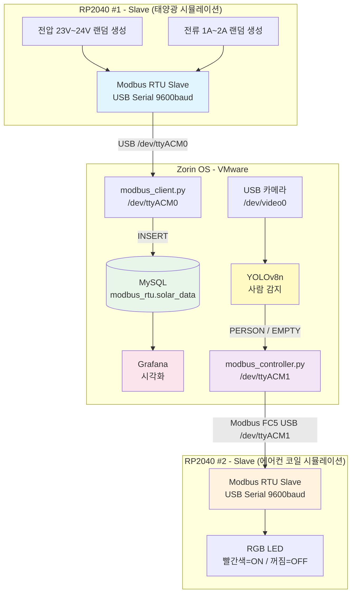
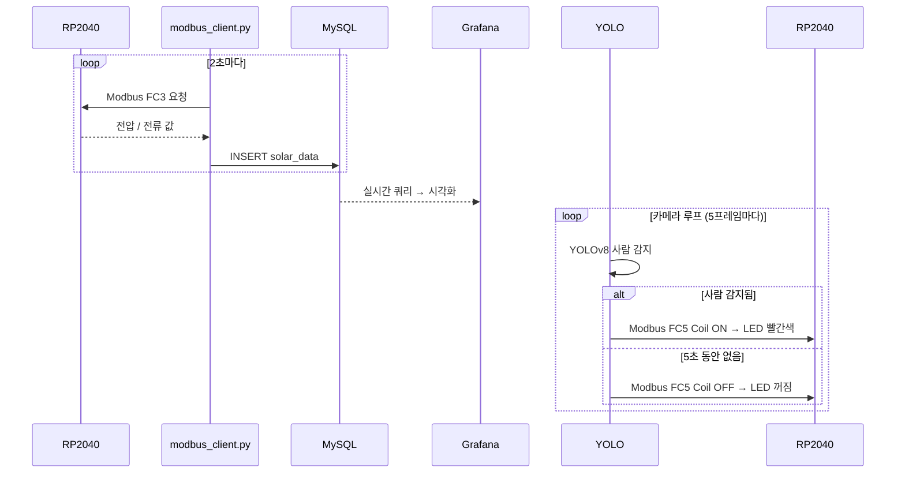

# RP2040 Modbus RTU 스마트 태양광 쉼터 제어 시스템

## 프로젝트 개요

태양광 쉼터를 시뮬레이션하는 **IoT 기반 제어 시스템**입니다.

- **RP2040 #1 (Slave)**: 태양광 모듈 시뮬레이션 — 전압/전류 데이터를 Zorin OS로 전송
- **RP2040 #2 (Slave)**: 에어컨 코일 시뮬레이션 — RGB LED ON/OFF로 동작 표현
- **Zorin OS (VMware)**: 데이터 수집·저장·시각화 + YOLO 사람 감지 → RP2040 #2 제어

---

## 시스템 아키텍처



---

## 데이터 흐름



---

## Holding Register 맵 (RP2040 #1)

| 레지스터 주소 | 내용 | 단위 | 예시 |
|--------------|------|------|------|
| 0 | 전압 | ×100 (정수) | 2350 = 23.50V |
| 1 | 전류 | ×100 (정수) | 150 = 1.50A |
| 2 | 상태 플래그 | 1=정상 | 1 |
| 3 | 업데이트 카운터 | 증가 | 42 |

---

## 구현 현황

### Phase 1: RP2040 구현

| 항목 | 상태 | 내용 |
|------|------|------|
| RP2040 #1 슬레이브 코드 | ✅ 완료 | 전압/전류 시뮬레이션, USB Serial 9600 |
| Modbus FC3 (레지스터 읽기) | ✅ 완료 | 레지스터 0~3 응답 |
| CRC-16 검증 | ✅ 완료 | |
| RP2040 #2 슬레이브 코드 | ✅ 완료 | FC5 수신 → RGB LED 제어 |

### Phase 2: Zorin OS 데이터 수집

| 항목 | 상태 | 내용 |
|------|------|------|
| Python Modbus 클라이언트 | ✅ 완료 | 전압/전류 읽기 |
| MySQL 데이터 저장 | ✅ 완료 | modbus_rtu.solar_data |
| Grafana 대시보드 | ✅ 완료 | MySQL 연동 |

### Phase 3: YOLO 통합

| 항목 | 상태 | 내용 |
|------|------|------|
| YOLOv8 환경 설치 | ✅ 완료 | Zorin OS venv |
| 카메라 감지 스크립트 | ✅ 완료 | /dev/video0 |
| Modbus 제어 스크립트 | ✅ 완료 | 5초 타임아웃 (테스트용) |
| 전체 통합 테스트 | ✅ 완료 | 사람 감지 → LED 제어 확인 |

### Phase 4: 통합 테스트

| 항목 | 상태 | 내용 |
|------|------|------|
| 전체 시스템 통합 테스트 | ✅ 완료 | |

---

## 실행 방법 (Zorin OS)

```bash
source ~/smart_shelter/venv/bin/activate

# 터미널 1: 태양광 데이터 수집
cd ~/smart_shelter/lamp_stack
python3 modbus_client.py

# 터미널 2: YOLO 감지 + LED 제어
cd ~/smart_shelter/yolo_detection
python3 camera_detection.py | python3 modbus_controller.py
```

---

## 디렉토리 구조

```
rp2040_modbus_rtu/
├── README.md
├── CLAUDE.md
├── rp2040_modbus_rtu.ino          # RP2040 #1 슬레이브 (전압/전류 시뮬레이션)
├── rp2040_master/
│   └── main/
│       └── main.ino               # RP2040 #2 슬레이브 (RGB LED 제어)
├── lamp_stack/
│   ├── modbus_client.py           # Python Modbus 클라이언트 + MySQL 저장
│   ├── modbus_client_visual.py    # 실시간 그래프 버전
│   ├── requirements.txt
│   ├── pyproject.toml
│   └── database/
│       └── schema.sql
└── yolo_detection/
    ├── camera_detection.py        # USB 카메라 + YOLOv8 감지
    ├── modbus_controller.py       # RP2040 #2 LED 제어
    ├── requirements.txt
    └── SETUP_GUIDE.md
```

---

## 환경 정보

### 하드웨어
- ✅ Arduino Nano RP2040 Connect #1 (Windows COM6 / Zorin /dev/ttyACM0)
- ✅ Arduino Nano RP2040 Connect #2 (Windows COM9 / Zorin /dev/ttyACM1)
- ✅ USB 카메라 (/dev/video0)

### 소프트웨어
- ✅ Arduino IDE (Mbed OS Nano Boards)
- ✅ VMware + Zorin OS
- ✅ Python venv (uv)
- ✅ MySQL (modbus_rtu DB)
- ✅ Grafana (MySQL 연동)
- ✅ YOLOv8n

---

## 주요 설정값

| 항목 | 값 |
|------|-----|
| Modbus 통신 속도 | 9600 baud |
| Slave ID | 1 |
| COM 포트 (RP2040 #1) | COM6 / /dev/ttyACM0 |
| COM 포트 (RP2040 #2) | COM9 / /dev/ttyACM1 |
| 전압 범위 | 23.00V ~ 24.00V |
| 전류 범위 | 1.00A ~ 2.00A |
| 데이터 수집 주기 | 2초 |
| YOLO 모델 | yolov8n.pt |
| YOLO 신뢰도 임계값 | 0.5 |
| 에어컨 OFF 타임아웃 | 5초 (테스트) / 300초 (실제) |

---

## 커밋 메시지 규칙

모든 커밋은 **한글**로 작성합니다.
- 예시: `기능: RP2040 전압/전류 시뮬레이션 구현`
- 예시: `수정: RGB LED WiFiNINA 제어로 변경`
- 예시: `문서: README.md 업데이트`

---

프로젝트 시작일: 2026년 3월 22일
