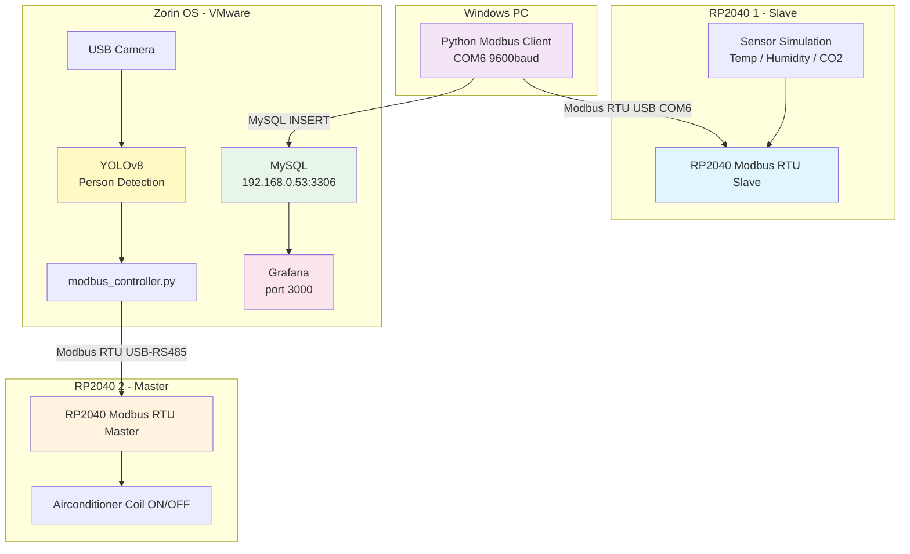
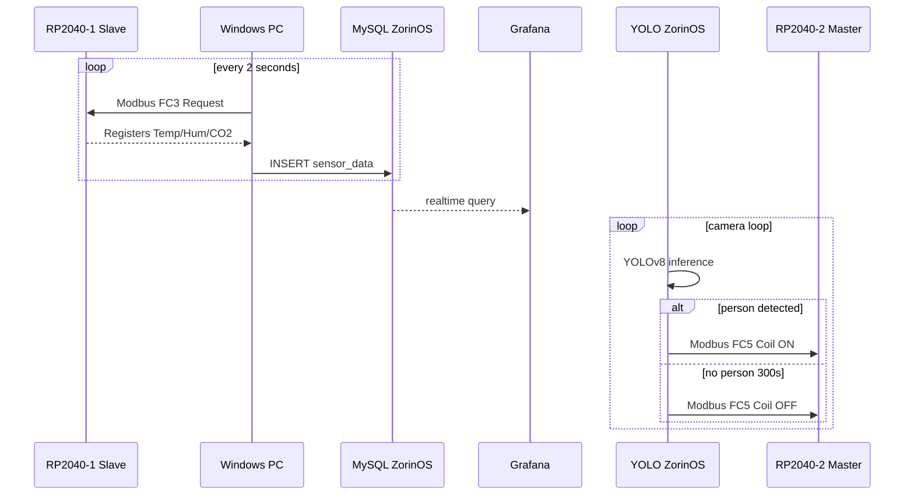

# RP2040 Modbus RTU 스마트 에어컨 제어 시스템

## 프로젝트 개요

태양광 쉼터의 환기 및 온도 제어를 위한 **IoT 기반 Modbus RTU 스마트 에어컨 제어 시스템**입니다.
현장의 RS-485 기반 인버터 등 장치가 준비되지 않은 관계로, **두 개의 RP2040**으로 마스터-슬레이브 시스템을 구축하고,
**LAMP Stack**과 **Grafana**로 실시간 모니터링, **YOLO 모델**로 사람 감지 시 자동 에어컨 제어를 수행합니다.

---

## 시스템 아키텍처



---

## 구현 현황

### Phase 1: RP2040 기본 구현

| 항목 | 상태 | 내용 |
|------|------|------|
| RP2040 #1 슬레이브 코드 | ✅ 완료 | Arduino C++, USB Serial 9600 baud |
| Modbus Function 3 (Read Holding Registers) | ✅ 완료 | 레지스터 0~4 응답 |
| 센서 데이터 시뮬레이션 | ✅ 완료 | 온도/습도/CO2 변동 시뮬레이션 |
| CRC-16 계산 | ✅ 완료 | 요청/응답 CRC 검증 |
| Serial Monitor 디버그 출력 | ✅ 완료 | 1초마다 센서 값 출력 |
| RP2040 #2 마스터 코드 | ⏳ 대기 | 코드 작성됨, 업로드 미완료 |

### Phase 2: LAMP Stack 통합

| 항목 | 상태 | 내용 |
|------|------|------|
| Python Modbus 클라이언트 | ✅ 완료 | Windows COM6 → RP2040 #1 |
| MySQL 데이터 저장 | ✅ 완료 | Zorin OS 192.168.0.53:3306 |
| 실시간 그래프 스크립트 | ✅ 완료 | modbus_client_visual.py (미테스트) |
| Grafana 대시보드 | ⏳ 대기 | MySQL 연동 설정 필요 |

### Phase 3: YOLO 통합

| 항목 | 상태 | 내용 |
|------|------|------|
| YOLO 환경 설치 | ✅ 완료 | Zorin OS venv, ultralytics>=8.3.0 |
| 카메라 감지 스크립트 | ✅ 완료 | camera_detection.py (미테스트) |
| Modbus 제어 스크립트 | ✅ 완료 | modbus_controller.py (시뮬레이션 모드) |
| 카메라 + YOLO 실제 테스트 | ⏳ 대기 | USB 카메라 연결 필요 |
| RP2040 #2 연동 | ⏳ 대기 | USB-RS485 어댑터 필요 |

### Phase 4: 통합 및 최적화

| 항목 | 상태 | 내용 |
|------|------|------|
| 전체 시스템 통합 테스트 | ⏳ 대기 | |

---

## Holding Register 맵 (RP2040 #1)

| 레지스터 주소 | 내용 | 단위 | 예시 |
|--------------|------|------|------|
| 0 | 온도 | ×100 (정수) | 2790 = 27.90°C |
| 1 | 습도 | ×10 (정수) | 550 = 55.0% |
| 2 | CO2 농도 | ppm | 580 |
| 3 | 상태 플래그 | 1=정상 | 1 |
| 4 | 업데이트 카운터 | 증가 | 2966 |

---

## 디렉토리 구조

```
rp2040_modbus_rtu/
├── README.md                          # 이 파일
├── CLAUDE.md                          # Claude Code 가이드
├── rp2040_modbus_rtu.ino              # RP2040 #1 슬레이브 (Arduino C++) ✅
├── rp2040_master/
│   └── main.ino                       # RP2040 #2 마스터 (Arduino C++) ⏳
├── lamp_stack/
│   ├── modbus_client.py               # Python Modbus 클라이언트 ✅
│   ├── modbus_client_visual.py        # 실시간 그래프 버전 ✅
│   ├── requirements.txt
│   └── database/
│       └── schema.sql                 # MySQL 테이블 정의 ✅
└── yolo_detection/
    ├── camera_detection.py            # USB 카메라 + YOLO 감지 ✅
    ├── modbus_controller.py           # 에어컨 Modbus 제어 ✅
    ├── requirements.txt
    └── SETUP_GUIDE.md
```

---

## 시스템 데이터 흐름



---

## 환경 정보

### 하드웨어
- ✅ **RP2040 Connect** #1 (USB COM6 연결 중)
- ⏳ **RP2040 Connect** #2 (준비 중)
- ⏳ **USB-RS485 어댑터** (RP2040 #2 ↔ Zorin OS 연결용)
- ⏳ **USB 카메라** (YOLO 감지용)

### 소프트웨어
- ✅ **Arduino IDE** (RP2040 C++ 코드 업로드)
- ✅ **VMware + Zorin OS** (LAMP Stack + Grafana + YOLO)
- ✅ **Python** (Windows, pyserial + mysql-connector-python)
- ✅ **MySQL** (Zorin OS, 192.168.0.53:3306, DB: modbus_rtu)
- ⏳ **Grafana** (설치됨, 대시보드 구성 필요)
- ✅ **YOLOv8** (Zorin OS venv 설치 완료)

---

## 주요 설정값

| 항목 | 값 |
|------|-----|
| Modbus 통신 속도 | 9600 baud |
| Slave ID | 1 |
| COM 포트 (Windows) | COM6 |
| MySQL 호스트 | 192.168.0.53:3306 |
| MySQL DB | modbus_rtu |
| 데이터 수집 주기 | 2초 |
| YOLO 모델 | yolov8n.pt (Nano) |
| YOLO 신뢰도 임계값 | 0.5 |
| 에어컨 OFF 타임아웃 | 300초 |

---

## 커밋 메시지 규칙

모든 커밋은 **한글**로 작성합니다.
- 예시: `기능: RP2040 Modbus RTU 슬레이브 구현`
- 예시: `수정: 시리얼 통신 타임아웃 버그`
- 예시: `문서: README.md 업데이트`

---

프로젝트 시작일: 2026년 3월 22일
