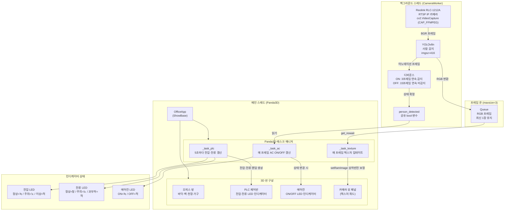
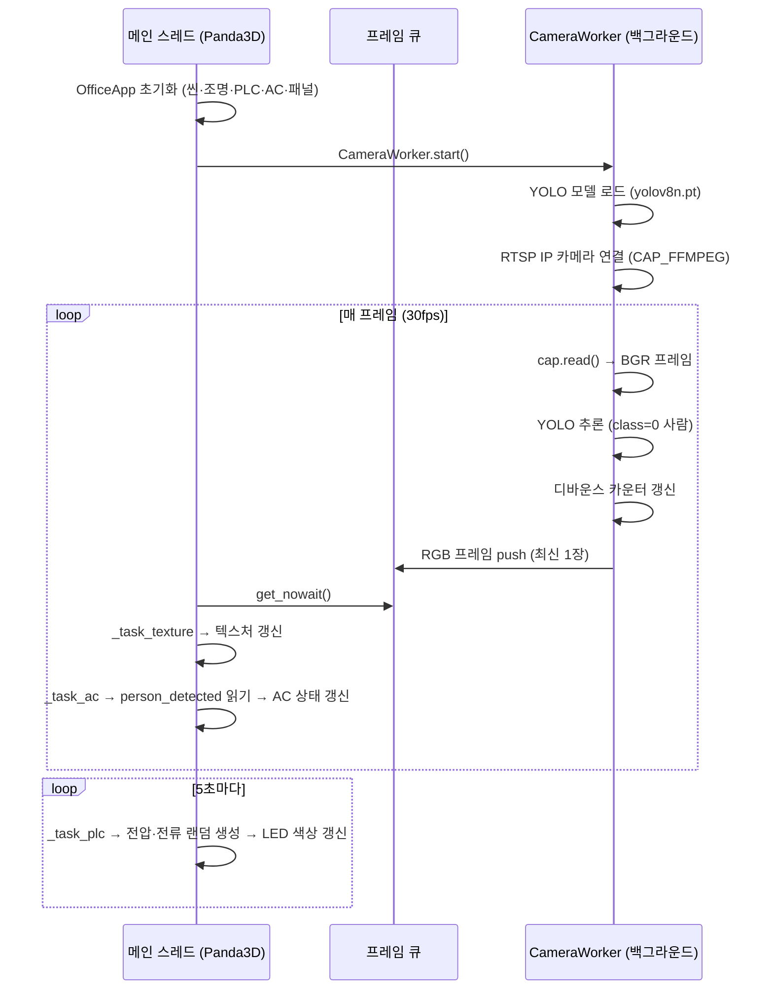
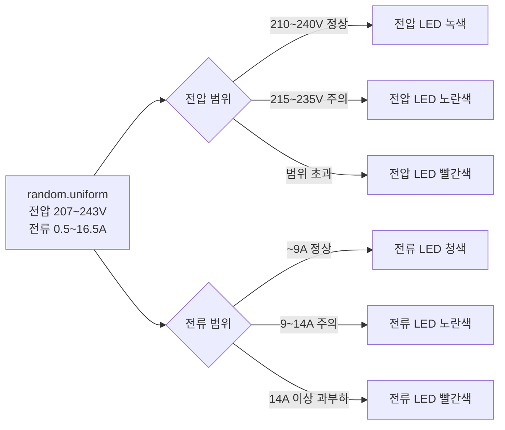
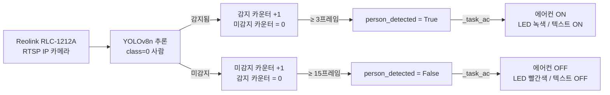

# 3D 오피스 공간 시뮬레이터

Panda3D 기반의 3차원 오피스 공간에 PLC, 에어컨, IP 카메라 뷰를 배치하고,  
YOLOv8로 실시간 사람을 감지하여 에어컨을 자동 제어하는 시뮬레이터입니다.

---

## 주요 기능

| 기능 | 설명 |
|---|---|
| 3D 오피스 공간 | 바닥·벽·천장·책상·의자·형광등으로 구성된 실내 씬 |
| PLC 제어반 | 5초마다 랜덤 전압(207~243V) / 전류(0.5~16.5A) 생성 및 LED 인디케이터 표시 |
| 에어컨 | 사람 감지 시 ON(녹색 LED), 미감지 시 OFF(빨간 LED) 자동 전환 |
| 카메라 뷰 패널 | Reolink RLC-1212A RTSP IP 카메라 영상을 실시간으로 3D 씬 내 패널에 렌더링 |
| YOLO 사람 감지 | YOLOv8n 모델로 사람을 실시간 검출, 바운딩 박스와 신뢰도 표시 |

---

## 시스템 블록도



---

## 아키텍처 설명

### 스레드 동작 흐름



### PLC 인디케이터 로직



### 에어컨 자동 제어 로직



---

## 3D 씬 레이아웃

```
  뒷벽 (y = +6)
  ┌──────────────────────────────────────────┐
  │  [PLC 제어반]   [카메라 뷰 패널]  [에어컨] │
  │  좌측 독립 설치   뒷벽 중앙 부착  뒷벽 우상 │  높이 3.5m
  │                                          │
  │              [책상]  [의자]              │
  │                                          │
  └──────────────────────────────────────────┘
  앞면 개방 (시점 방향)

  시점 카메라: (0, -4.5, 3.0) → lookAt(0, 5.5, 2.2)  FOV=55°
```

| 오브젝트 | 위치 (x, y, z) | 크기 W × D × H |
|---|---|---|
| 오피스 방 | (0, 0, 0) 중심 | 14 × 12 × 3.5 m |
| PLC 제어반 | (-2.8, 4.5, 0.9) | 1.0 × 0.45 × 1.8 m |
| 에어컨 | (3.5, 5.75, 2.85) | 2.2 × 0.35 × 0.65 m |
| 카메라 뷰 패널 (프레임) | (-0.5, 5.86, 1.9) | 4.10 × 0.10 × 3.10 m |
| 카메라 뷰 패널 (화면) | (-0.5, 5.82, 1.9) | 3.84 × 2.88 m |
| 책상 | (0, -1, 0.75) | 2.0 × 1.0 × 0.06 m |

---

## 설치 및 실행

### 요구 사항

- Python 3.11 이상
- [uv](https://github.com/astral-sh/uv) 패키지 매니저
- Windows 10/11
- Reolink RLC-1212A IP 카메라 (또는 RTSP 지원 카메라)
- 카메라와 같은 LAN 네트워크 연결

### 의존 패키지

```toml
dependencies = [
    "panda3d>=1.10.13",      # 3D 렌더링 엔진
    "opencv-python>=4.8.0",  # 카메라 캡처 및 영상 처리
    "ultralytics>=8.0.0",    # YOLOv8 객체 감지
    "numpy>=1.24.0",         # 행렬 및 텍스처 버퍼 처리
]
```

### 설치

```bash
uv sync
```

### YOLO 모델 사전 다운로드 (최초 1회)

```bash
uv run python -c "from ultralytics import YOLO; YOLO('yolov8n.pt')"
```

> `yolov8n.pt` (약 6 MB) 가 프로젝트 폴더에 저장됩니다.  
> 이후 실행부터는 로컬 파일을 즉시 로드합니다.

### RTSP 카메라 설정

`main.py` 상단의 `RTSP_URL` 변수를 실제 카메라 주소로 수정하세요.

```python
# Reolink RLC-1212A 기본 설정 예시
RTSP_URL = "rtsp://<user>:<password>@<camera-ip>:554/h264Preview_01_sub"
```

> 카메라에 연결할 수 없는 경우 더미 모드로 자동 전환되어 "NO CAMERA" 화면을 표시합니다.

### 실행

```bash
uv run python main.py
```

| 키 | 동작 |
|---|---|
| `ESC` | 프로그램 종료 |

---

## 파일 구성

```
pesco-jungju/
├── main.py          # 메인 애플리케이션 (전체 로직)
├── yolov8n.pt       # YOLOv8n 가중치 (최초 실행 시 자동 다운로드)
├── pyproject.toml   # 프로젝트 메타데이터 및 의존성 정의
├── README.md        # 본 문서
└── .venv/           # uv 가상환경
```

---

## 기술 스택

| 분류 | 라이브러리 | 용도 |
|---|---|---|
| 3D 렌더링 | [Panda3D](https://www.panda3d.org/) | 씬 그래프, 조명, 텍스처, 태스크 매니저 |
| 영상 처리 | [OpenCV](https://opencv.org/) | USB 카메라 캡처, 어노테이션, 색공간 변환 |
| 객체 감지 | [Ultralytics YOLOv8](https://github.com/ultralytics/ultralytics) | 실시간 사람(class 0) 감지 |
| 수치 연산 | [NumPy](https://numpy.org/) | 프레임 배열 처리, 텍스처 버퍼 변환 |
| 패키지 관리 | [uv](https://github.com/astral-sh/uv) | 가상환경 및 의존성 관리 |

유튜브 동영상 

https://youtu.be/jXBWLOkaaTE
